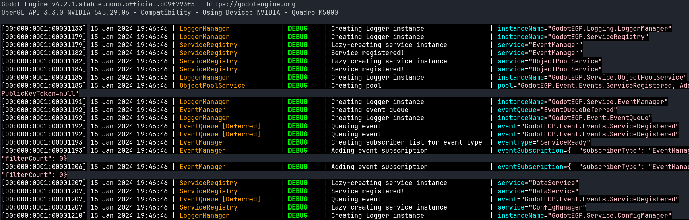

# GodotEGP - A C# framework for Godot
This project is a collection of experimental systems and patterns that I created to serve as the foundation of my Godot game projects written in C#.

The framework is a Godot addon, and should be located in the `addons` directory of a Godot project. E.g. `PROJECT_ROOT/addons/godotegp-framework`.

## LoggerManager - Fancy logging for all!

IMAGE

The first component of the framework is an extendable Logger class providing useful coloured output to the Godot console. It includes timestamp including milliseconds ticks passed and current date & time, the name of the class which called the log request, the log level, the logged message, and an optional data dump of a variable or object.

Logging with the `LoggerManager` is my replacement to using `GD.Print()`, so that I don't have to worry about formatting a useful log string every time. Instead, it's just as simple as this: `LoggerManager.LogDebug("Godot ftw!")`.

I use my own logger exclusively instead of `GD.Print()`.

### Log levels
Different logging levels are available:

- `LoggerManager.LogTrace("this is a trace message and will print the file path and line number")`
- `LoggerManager.LogDebug("the best kind of log!")`
- `LoggerManager.LogInfo("something informational")`
- `LoggerManager.LogWarning("a warning")`
- `LoggerManager.LogError("something went wrong")`
- `LoggerManager.LogCritical("something went really wrong")`

The current log level can be configured, suppressing any logs lower than the configured level. The default for a Debug build is `Trace`, while the default for a Release build is `Info`.

### Data dumping
Each logging method supports 4 parameters, the last 2 being the data dump name and the data/object to dump. It's then rendered out like this at the end of the line: `dataName=dataContent`.

`LoggerManager.LogDebug("Godot ftw!", "", "dataName", someObjectToDump)`

Under the hood the object is being serialised and printed as JSON.

### Logging Destinations
The `Logging.Destination` namespace includes `IDestination` allowing implementation of a custom logging destination, such as a filesystem log or a remote logging destination.

Different classes can have different destination groups configured, allowing for a tailored logging configuration.

The included destination implementations are `DefaultConsole` and `GodotConsole`.

### Output Formatters
The `Logging.Formatter` namespace includes `IFormatter`, allowing implementation of custom pre- and post- text formatting steps on each component, including setting the final formatting string.

The included formatter implementations are `TextFormatter` for non-colourized output, and `GodotRichFormatter` building on-top of the `TextFormatter` providing Godot colourised output.
## Service Registry - A Service Locator

The main component offered by the framework is the `ServiceRegistry` class which provides lazy-loading access to Godot Node instances inheriting from the `Service` class. Services are persistent, single instance nodes designed to provide access to Managers/Handlers/Configurations from anywhere in the project.

Creating a service is easy, it just needs to extend `GodotEGP.Service.Service`, and then you get and create an instance automatically like so: `ServiceRegistry.Get<YourServiceClass>()`.

### ObjectPoolService - Create and manage object instances

### EventManager - Subscription-based global event bus

### ConfigManager - Create, update, access configurations

### ResourceManager - Define resources, access them

### SaveDataManager - Manage Save data files, slots, and more

### InputManager - Handle and subscribe to Input events

### NodeManager - Easily access and subscribe to Nodes in a scene

### DataBindManager - Bind object-to-object data

### SceneManager - Manager Scene resources and easily switch scene

### ScreenTransitionManager - Trigger a screen transition scene

### SceneTransitionManager - Combined Scene manager and Transition manager

### ScriptService - Run scripts in the built-in Bash scripting interpreter

### RandomService - Generate random numbers

### SystemService - Various access to system info

Various other components are included, and it's recommended to explore the code base.
